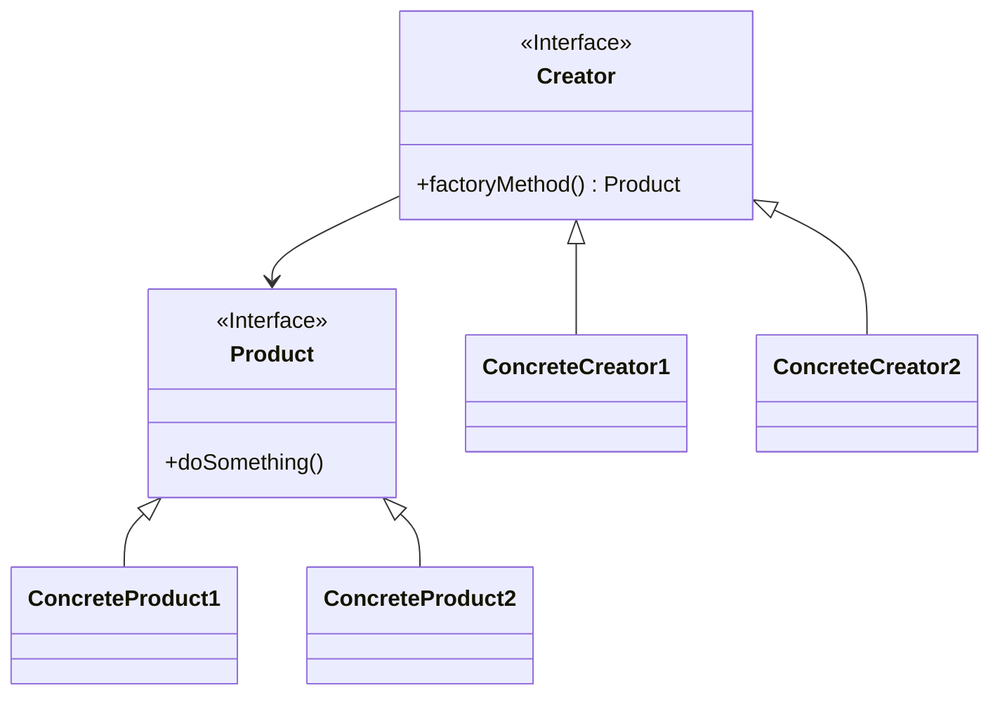

<!-- * TOC
{:toc} -->

# 前言  

记录了对工厂方法模式的学习，以及如何使用 Swift 语言实现工厂方法模式。

# 工厂方法模式（Factory Method Pattern）  

工厂方法模式：定义一个用于创建对象的接口，让子类决定实例化哪一个类。工厂方法使一个类的实例化延迟到其子类。  

工厂方法模式主要角色如下：  

 - 抽象工厂（Abstract Factory）：提供了创建产品的接口，调用者通过它访问具体工厂的工厂方法来创建产品。
 - 具体工厂（Concrete Factory）：主要是实现抽象工厂中的抽象方法，完成具体产品的创建。
 - 抽象产品（Product）：定义了产品的共性，描述了产品的主要特性和功能。
 - 具体产品（ConcreteProduct）：实现了抽象产品角色所定义的接口，由具体工厂来创建，它同具体工厂之间一一对应。

通用类图如下：  



概念示例如下：  

```swift
// 抽象工厂
protocol Creator {
    func factoryMethod() -> Product
}
// 抽象产品
protocol Product {
    func doSomething() -> Void
}

// 具体的实现工厂 1
class ConcreteCreator1: Creator {
    func factoryMethod() -> Product {
        print("工厂 1 开始生产。..")
        return ConcreteProduct1();
    }
}
// 具体的产品 1
class ConcreteProduct1: Product {
    func doSomething() {
        print("生产出产品 1")
    }
}

// 具体的实现工厂 2
class ConcreteCreator2: Creator {
    func factoryMethod() -> Product {
        print("工厂 2 开始生产。..")
        return ConcreteProduct2();
    }
}
// 具体的产品 2
class ConcreteProduct2: Product {
    func doSomething() {
        print("生产出产品 2")
    }
}

// 运行不同的工厂
ConcreteCreator1().factoryMethod().doSomething();
ConcreteCreator2().factoryMethod().doSomething();
```

下面展示一个比较实用、易扩展的使用示例：  

```swift
// 抽象工厂
protocol Creator: class {
    func factoryMethod<T: Product>(product: T.Type) -> T
}
// 抽象产品
protocol Product: class {
    init()
    func doSomething() -> Void
}

// 具体的实现工厂
class ConcreteCreator: Creator {
    init() {
        print("工厂开始生产。..");
    }
    // 工厂方法
    func factoryMethod<T: Product>(product: T.Type) -> T {
        return product.init()
    }
}

// 具体的产品 1
class ConcreteProduct1: Product {
    required init() {}
    func doSomething() {
        print("生产出产品 1")
    }
}

// 具体的产品 1
class ConcreteProduct2: Product {
    required init() {}
    func doSomething() {
        print("生产出产品 2")
    }
}

let creater = ConcreteCreator();
creater.factoryMethod(product: ConcreteProduct1.self).doSomething()
creater.factoryMethod(product: ConcreteProduct2.self).doSomething()
```

## 工厂方法模式的应用  

### 优点  

#### 良好的封装性，代码结构清晰  

一个对象创建是有条件约束的，如一个调用者需要一个具体的产品对象，只要知道这个产品的类名（或约束字符串）就可以了，不用知道创建对象的艰辛过程，降低模块间的耦合。  

#### 扩展性非常优秀  

在增加产品类的情况下，只要适当地修改具体的工厂类或扩展一个工厂类，就可以完成“拥抱变化”。  

#### 屏蔽产品类  

产品类的实现如何变化，调用者都不需要关心，它只需要关心产品的接口，只需接口保持不变，系统中的上层模块就不要发生变化。因为产品类的实例化工作是由工厂类负责的，一个产品对象具体由哪一个产品生成是由工厂类决定的。  

#### 解耦框架  

高层模块值需要知道产品的抽象类，其他的实现类都不用关心，符合迪米特法则，我不需要的就不要去交流，也符合依赖倒置原则，只依赖产品类的抽象，当然也符合里氏替换原则，使用产品子类替换产品父类，没问题！  

## 工厂方法模式扩展  

### 简单工厂模式（Simple Factory Pattern）  

一个模块仅需要一个工厂类，我们就没有必要把它产生出来，使用静态的方法就可以了，所以也叫静态工厂模式。示例如下：  

```swift
// 抽象产品
protocol Product: class {
    init()
    func doSomething() -> Void
}

// 具体的产品 1
class ConcreteProduct1: Product {
    required init() {}
    func doSomething() {
        print("生产出产品 1")
    }
}

// 具体的产品 1
class ConcreteProduct2: Product {
    required init() {}
    func doSomething() {
        print("生产出产品 2")
    }
}

// 具体的实现工厂
class ConcreteCreator {
    // 静态工厂方法
    class func factoryMethod<T: Product>(product: T.Type) -> T {
        return product.init()
    }
}
ConcreteCreator.factoryMethod(product: ConcreteProduct1.self).doSomething()
ConcreteCreator.factoryMethod(product: ConcreteProduct2.self).doSomething()
```

### 多个工厂类  

当项目复杂时，每个实现类的初始化都不相同时，写在一个工厂方法中，会使代码结构不清晰。此时需要结构清晰的代码，我们可以为每一个产品定义一个工厂类，然后由创建者自己去选择工厂方法，如概念示例就是采用的多个工厂类。但是这样就会增加扩展和维护的难度。  
采用多个工厂类，一般会再增加一个协调类，避免调用者与各个子工厂交流，协调者的作用是封装子工厂类，对高层模块提供统一的访问接口。  
