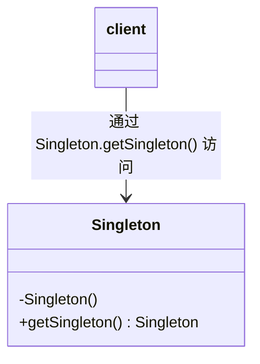

<!-- * TOC
{:toc} -->

# 前言  

本系列主要记录了对【设计模式之禅】的学习总结，并例举了如何使用 Swift 语言实现。本章记录了单例模式的学习。

# 单例模式（Singleton Pattern）  

单例模式：确保某一个类只有一个实例，而且自行实例化并向整个系统提供这个实例。单例模式是一种 **创建型设计模式** 。   

在一个系统中，要求一个类有且仅有一个对象，如果出现多个对象就会出现“不良反应”，可以采用单例模式，具体的场景如下：  
 - 要求生成唯一序列号的环境。
 - 在整个项目中需要一个共享访问点或共享数据。
 - 创建一个对象需要消耗资源过多，如要访问 IO 和数据库等资源。
 - 需要定义大量的静态常量和静态方法（如工具类）的环境，可以采用单例模式（也可以直接声明为 static 的方式）。

## 单例模式的优缺点  

优点：  
 - 只有一个实例，减少了内存开支。
 - 只生成一个实例，减少了性能开销。
 - 避免对资源的多重占用。
 - 在系统设置全局访问点，优化和共享资源访问。

缺点：  
 - 没有接口，扩展很困难，基本只能修改代码。
 - 对测试不利。
 - 与单一职责原则有冲突。一个类应该只实现一个逻辑，而不关心它是否是单例的，是不是要单例取决于环境，单例模式把“要单例”和业务逻辑融合在一个类中。

## Swift 语言单例模式的创建

在创建的时候需要注意如下事项：  
 - 注意线程同步问题。
 - 对象复制的问题。

Swift 采用与 Java 类似的方式，对全局变量实行懒加载。这样的设计是的构造器可以自定义、启动时间不会因为加载全局变量而变慢、同时操作执行的顺序也变得可控。  
全局变量（结构体和枚举体的静态成员）的懒加载在初始化时会使用 **dispatch_once** 以确保初始化的原子性。所以这是一个很酷地使用 **dispatch_once** 的方式：仅在定义全局变量时将其构造器标志为 **private** 就行。  

通用类图如下：  



最简单的实用的单例创建：  

```swift
public class Singleton {
  // 自行实例化一个静态不可变的实例，这就是唯一的实例
  public static let shared = Singleton();
  // 确保在一个应用中只产生一个实例，并且只能自行实例化
  private init() {}
}

// 访问实例
Singleton.shared;
```

如果需要在实例化后做一下操作，可以实用如下方法：  

```swift
public class Singleton {
  // 通过闭包返回唯一实例
  public class func shared() -> Singleton {
    return _shared;
  }
  // 私有静态变量
  private static let _shared: Singleton = {
    let shared = Singleton();
    // do something...
    return shared;
  }();
  // 确保在一个应用中只产生一个实例，并且只能自行实例化
  private init() {};
}

// 访问实例
Singleton.shared();
```

对单例置空，可以使用如下：

```swift
public class Singleton {
  // 通过闭包返回唯一实例
  public class func shared() -> Singleton {
    guard let shared = _shared else {
      _shared = Singleton();
      return _shared;
    }
    return shared;
  }
  // 销毁实例
  public class destroy() {
    _shared = nil;
  }
  // 私有静态变量
  private static let _shared: Singleton?;
  // 确保在一个应用中只产生一个实例，并且只能自行实例化
  private init() {};
}

// 访问实例
Singleton.shared();
// 销毁实例
Singleton.destroy();
```
